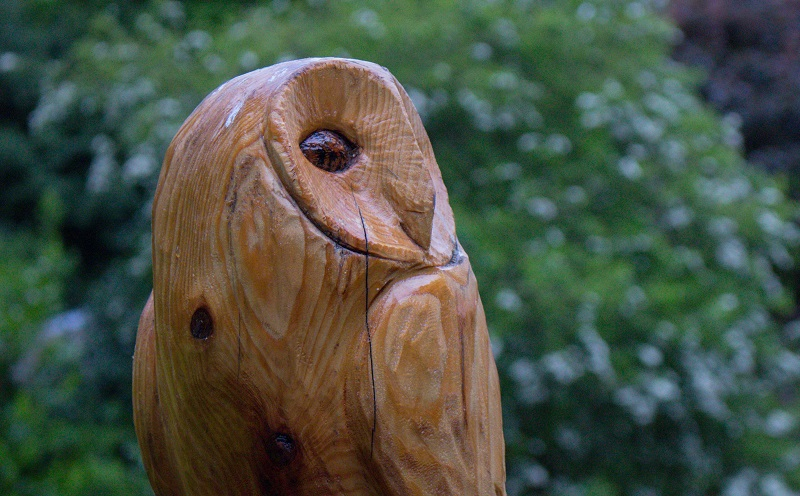

<!DOCTYPE html>
<html lang="en">

<head>
  <meta charset="UTF-8">
  <meta name="viewport" content="width=device-width, initial-scale=1.0">
  <meta name="author" content="Dominic Arthur">
  <title>D. Arthur</title>
  <noscript>
    
<strong>This web page requires JavaScript to be enabled.</strong>

    
JavaScript is an object-oriented computer programming language 
    commonly used to create interactive effects within web browsers.

    
<a href="https://goo.gl/koeeaJ">How to enable JavaScript?</a>

  </noscript>
  
  <link rel="stylesheet" href="https://cdnjs.cloudflare.com/ajax/libs/font-awesome/4.7.0/css/font-awesome.min.css">
  <link rel="stylesheet" href="headerstyle.css"/>
  <link rel="stylesheet" href="mainstyle.css"/>
  <link rel="stylesheet" href="footerstyle.css"/>
  <link rel="stylesheet" href="gallerystyle.css"/>
  <link rel="stylesheet" href="aboutstyle.css"/>
  <link rel="stylesheet" href="progressstyle.css"/>
  <link rel="stylesheet" href="blogstyle.css"/>
</head>

<body>

  <header class="header" id="header">
    

      <h1 class="logo">D.ARTHUR</h1>
    

    <nav class="navcontainer">
      <ul class="navbar">
        <li><a href="#home">Home</a></li>
        <li><a href="#blog">Blog</a></li>
        <li><a href="#gallery">Gallery</a></li>
        <li><a href="#progress">Progress</a></li>
        <li><a href="#about">About</a></li>
        <li><a href="#contact">Contact</a></li>
      </ul>
    </nav>

    

      

        <a href="javascript:void(0)" class="closebtn" onclick="closeNav()">&times;</a>
        <a href="#home" onclick="closeNav()">Home</a>
        <a href="#blog" onclick="closeNav()">Blog</a>
        <a href="#about" onclick="closeNav()">About</a>
        <a href="#gallery" onclick="closeNav()">Gallery</a>
        <a href="#progress" onclick="closeNav()">Progress</a>
        <a href="#contact" onclick="closeNav()">Contact</a>
      

      <button class="openbtn" onclick="openNav()" id="openbtn">&#9776;</button>
    

  </header>

  <main class="main">
    <section class="home" id="home">
      

        

        

        

        

        

          

            
Hi!

            
I'm Dominic, an aspringfreelance web developer  and photography enthusiast.

          

          
Do you need a website for your business or portfolio? 
          Well, I've got your back. Let me help you with a stunning professional
          look website while you focus on what you do best.

        

      

    </section>

    <section class="gallery" id="gallery">
      

        <h2>Gallery</h2>
        
<i>THE WORLD LOOK A LOT MORE BEAUTIFUL THROUGH THE LENSE.</i>

        
      

          <!--Gallery Modal-->
      

        &times;
        
        

      

      

        

          
          
          
          
          
          
        

        

          
          
          
          
          
          
        

        

          
          
          
          
          
          
        

        

          
          
          
          
          
          
        

      

      <button class="gallery-button">
      <a href="https://www.instagram.com/da_fotografy/" target="_blank">SEE MORE</a>
      </button>
    </section>

    <section class="about" id="about">
      

        

          
        

        <h2>About Dominic</h2>

        
Dominic Arthur is a second year Immunology with Management student at The University of Edinburgh and an aspiring freelance web developer. His hunger for knowledge and determination to turn ideas into action drives him to take interest in different aspects of life. Aside from his quest to acquire multiple skills, Dominic loves to play football, workout, dance, listen to music and, hangout with friends to be both physically and mentally healthy. I almost forgot!, Dominic have recently taken interest in boxing and he have signed up for boxing classes. He also likes to be creative, so Dominic do photography as a hobby.  Dominic developed this website without using any of the web development frameworks like W3.CSS, Bootstrap, Vue, etc in other to showcase his level of competence with the three main web development technologies, that is JavaScript, CSS and, HTML.  As of now, Dominic is expanding his knowledge on different aspects of web development and at the same time working on his photographic skills.  <i> All in all, Dominic like to describe himself as an inquisitive young man of few words.</i>

      

    </section>

    <section class="progress" id="progress">
      <h2>Work in progress.</h2>
      

        
HTML

        

          
80%

        

        
Python

        

          
75%

        

        
CSS

        

          
65%

        

        
Javascript

        

          
50%

        

      

    </section>

    <article class="blog" id="blog">
      <h2>D. Arthur's Blog</h2>
      
It is always good to express views, thoughts and ideas in writing.

      

        

          
          <h3 class="blogtle" id="blogtle">A Photograph Worth a Thousand Words.</h3>
          
<b>June 1st 2020</b>

          

            I have recently found myself in the world of photography and it is incredibly fascinating. Every photograph freezes a moment and tells a story. A moment you will always relive in anytime you look back at that picture. I find it interesting how light, shadows and shades of colours come together to convey some sort of unexplainable feeling in an image. Today I share with you one of my favourite photographs I have shot since I began to look at the world through my lens. 

          

            The person in the picture is sitting in the dark on the edge of a cliff looking at a source of light from miles away. The hope of the rising sun brings to us a fleeting moment of faith, love and trust. Every night we go to sleep trusting that we will wake up and live through another day.

          
This is the story I want this photograph to convey or tell.<button class="blogbtn" id="expand" onclick="expandFunction()">expand</button>

          

            

              Think of it like this, imagine you are the person in the picture and the source of light is something you have always dreamed of. This could be anything, a new job, a degree, a new car, a life partner, etc. In the photograph, the only thing that is separating the person from the light is a massive river. Nevertheless, he can get to the light, either by swimming, by boat or by flight, the same way you! can make your that dream comes true. The different ways the person could get to the light has their own risks and hurdles. For instance, if he decides to swim, he might have to learn how to swim. Even if he can swim, he cannot be certain about what to expect in the river There could be sharks or something that pose a threat or that will make the journey difficult. The same applies to you. Oftentimes, knowing they way to your destination is not enough. However, with 'knowing' comes hope and courage. And with hope and courage, one can make the impossible possible.

           

              I hope you find some inspiration from this short message. Of course, people see things from different perspectives so your story from this photograph might be different from mine and I would love to hear yours :) Thanks for reading this far.<button class="blogbtn" id="collapse" onclick="collapseFunction()">collapse</button>

          

        

      

    </article>
  </main>

  <footer class="footer">
    <a href="#header" class="footlink"><i class="fa fa-arrow-up"></i>To the top</a>
    

      
You can contact me on <b>+44-73954141619</b> or on any of the following platforms

  
      <a href="https://www.facebook.com/d.arthur.101/" target="_blank" class="contactlink">
        <i class="fa fa-facebook-official"></i>
      </a>
  
      <a href="https://www.instagram.com/da_fotografy/" target="_blank" class="contactlink">
        <i class="fa fa-instagram"></i>
      </a>
  
      <a href="www.linkedin.com/in/dominic-arthur" target="_blank" class="contactlink">
        <i class="fa fa-linkedin"></i>
      </a>
    

    
<i><small>&copy 2020 Dominic Arthur All Rights Reserved</small></i>

  </footer>

</body>
</html>
